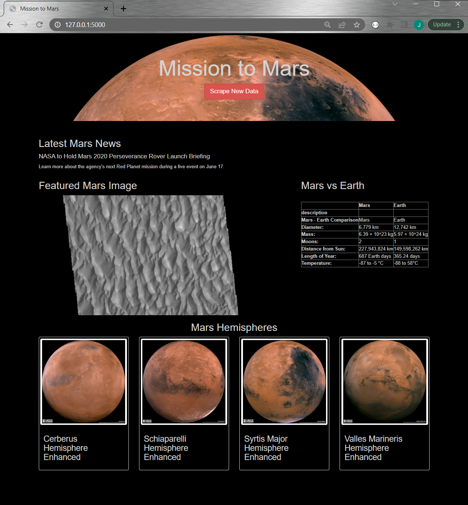
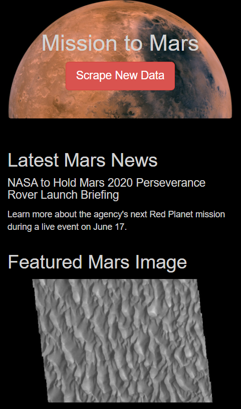

# Space Exploration

## Overview:
Wrote a Python script that scrapes data related to the Mars Missions at the push of a button, and presents it in an easy-to-digest format that is compatible with desktops as well as mobile devices. 

Web scraping code was first tested in a Jupyter Notebook and eventually exported into a plain Python Script `scraping.py` which was then integrated with our Flask app `space_app.py`. Finally, everything was pulled together and presented using HTML (`/templates/index.html`).

### Desktop View

### Mobile View

# Resources:
## Websites:
- https://redplanetscience.com
- https://spaceimages-mars.com
- https://galaxyfacts-mars.com
- https://marshemispheres.com

## Tools:
- Python (Code tested in Jupyter Notebook first)
    - Flask, Splinter, BeautifulSoup, ChromeDriverManager, Pandas, PyMongo
- HTML with Bootstrap 3 and CSS
- MongoDB (NoSQL Database)